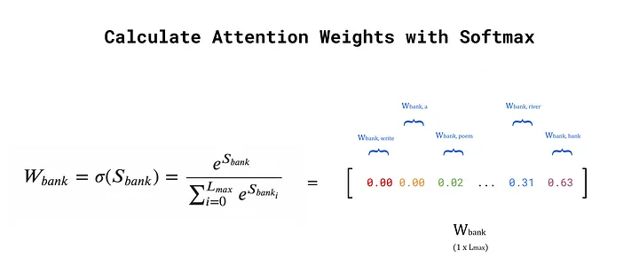

# Attention and Transformers Tutorial 

Large Language Models such as models in the GPT, BERT, and Llama families have shown impressive performance on several language generating tasks, ranging from chat completion to machine translation and text summarization, to name a few. One reason for their success lies in the design of their architecture which is based on the   **Transformer** architecture.   


## The Transformer Architecture 
In what follows, we will go through the basic  components of a transformer to fully understand their functionality and purpose.  
 
<center width="100%"></center>
<center width="100%"><small>Image by Vaswani, Ashish, et al. "Attention is all you need." (2017) and Philip Lippe</small><br><br></center>


To this end we will use the following example. Imagine that we have the following sentence 

``` Write a poem about a man fishing on a river bank. ```

and that we would like to give it as input to the transformer. Our goal is to understand what will happen to this sentence as it goes through a transformer.

## Tokenization
First, our sentence will be broken down into tokens (that could be words or parts of words) by a tokenizer, and may look like

``` Write```, ```a```, ```poem```, ```about```, ```a```, ```man```, ```fishing```, ```on```, ```a```, ```river```, ```bank``` 

Next, assuming that we have a vocabulary of $V$ tokens in total, each token above will be mapped to an integer token ID, which is the position of the token in the vocabulary.


## Input Embedding

Each of the token IDs will be then mapped to an embedding vector of dimension $d_{\text{model}}$, that is essentially a multidimensional representation for each token that our transformer learns through training. The mapping will happen in practice by multiplying a one-hot encoded vector created from each token ID with a $V \times d_{\text{model}}$ matrix, that has the embedding vector for every token in the vocabulary. We can see an example of this matrix below.   


<center width="100%"></center>

<center width="100%"><small>Image by Vaswani, Ashish, et al. "Attention is all you need." (2017) and Bradney Smith</small></center>

## Positional Encoding 

The learned embeddings above do not capture any information about the position of each token in the sentence. However, the position of each token or word in a sentence is important as it does affect the meaning of our sentence. For example, it is different to say

```Now come here!```

and to say

```Come here now!```

In the first case, we put emphasis on the action (come here), while in the second we put emphasis on when we want the action to happen (now). All this information would be lost if we had only knowledge about the representation of each token.

In order to keep this information, we would like to add somehow in our embeddings, information about the position of the tokens. This can be done by a function that we would ideally like to be 

* **Bounded** — we do not want too large values during training
* **Periodic** — patterns that repeat are easier to learn
* **Predictable** —  the model should be able to understand the position of each of the embeddings in sequences that it has not seen before.
    
The positional encoding function $PE$ we learned in class [2] is one function that satisfies the above. We remind that this function, for the $k$-th token in the input  
$$
PE(k,i) = 
\begin{cases}
  \sin\left(k / 10000^{\frac{2i}{d_{\text{model}}}}\right) & \text{if } i \text{ is even} \\
  \cos\left(k / 10000^{\frac{2i}{d_{\text{model}}}}\right)  & \text{if } \text{ otherwise},
\end{cases}
$$
where $i$ is the index of each embedding dimension, ranging from $i=0$ (for the first embedding dimension) up to $d_{\text{model}}$. Note this not the only way to capture positional information; some models directly learn positional encodings with backpropagation using random initialization.

Once we add the positional encoding information to our input embeddings, our sentence will have been through the following stages

<center width="100%"></center>
<center width="100%"><small>Image by Bradney Smith</small><br><br></center>

Our sentence is now ready for the next component of the transformer, which we call the self-attention mechanism and is basically the heart of the transformer.


## The Self-Attention Mechanism: The Heart of the Transformer

The purpose of the self-attention mechanism is to capture contextual information between the tokens in our input sentence. It is not only the representation and the position of a token or word that they give it a meaning, but also the context, i.e., the other words in the sentence. For example, the word `bank` would have a very different meaning if our sentence was given in a different context such as

```Write a poem about a man applying for a loan in a bank``` 

In the above sentence, the word `loan` gives us a very different context, giving `bank` the meaning of a financial institution, whereas in our sentence the words `fishing` and `river`, give `bank` the meaning of the land alongside the river. In both sentences, though, words like `a` do not provide any context information. 

What we would like to have is a mechanism with which it would become apparent that in our sentence the word `river` gives more important context information on the word `bank` compared to the word `a` gives; one could say that `river` is more relevant to the word `bank` than `a` is. The way the self-attention mechanism achieves this is by computing a measure of *similarity* between the token embeddings; tokens that are more relevant between each other, have a higher measure of similarity.  

### Similarity via the dot product

One could use several measures of similarity between embedding vectors, such as distance, e.g., Euclidean distance, or angle distance, e.g., cosine similarity. Both of the above examples are expensive to compute, while the latter also completely looses information about the magnitude of the embeddings and considers parallel embeddings as the same embedding. 

The self-attention mechanism uses the **dot product** as a similarity metric, as this metric keeps information both about magnitude and angle and also is very easy to compute. Back to our example, to find the similarity of the word `bank` with each of the words in our input sentence one would do

<center width="100%"></center>
<center width="100%"><small>Image by Bradney Smith</small><br><br></center>

where $L_{\text{max}}$ is the maximum length of a sequence from which a model can derive context, which is called the context length. In models like ChatGPT, the context includes the current prompt as well as all previous prompts and responses in the conversation (within the context length limit). This limit is typically in the range of a few thousand tokens, with GPT-3 supporting up to 4096 tokens and GPT-4 enterprise edition capping at around 128,000 tokens. In practice,  if the actual context sequence in smaller than $L_{\text{max}}$, $X$ is padded with zeros. 

One problem with the dot product though, could be that it can become arbitrarily large, which is something we would like to avoid during training. Therefore, we would prefer to scale it down, i.e., we would prefer a **scaled dot-product**. One way to scale it down is to normalize it by dividing the dot-product with $\sqrt{d_{\text{model}}}$, where we would have the vector of similarity scores 

$$
    S_{\text{bank}}  = \frac{X_{10} \cdot X^{T}}{\sqrt{d_{\text{model}}}},
$$
where each element $S_{\text{bank},i}$ would be the similarity score between the word `bank` and the word `i` in the input sentence.

### Attention weights

The self-attention mechanism uses the scores of the vector $S_{\text{bank}}$ to construct attention weights $W_{\text{bank}, i}$ for each token $i$ in the input sentence that represent the context information that the token $i$ provides for the token `bank`. To construct such weights, we use the softmax function  

<center width="100%"></center>
<center width="100%"><small>Image by Bradney Smith</small><br><br></center>


### Transformer embedding

Using the attention weights, we can *transform* the input embedding for the token `bank`  to an embedding that has the context information we discuss above, by computing the weighted sum

<center width="100%"></center>
<center width="100%"><small>Image by Bradney Smith</small><br><br></center>


We summarize the entire process to generate the new embedding for the word `bank` as follows
<center width="100%"></center>
<center width="100%"><small>Image by Bradney Smith</small><br><br></center>

### Self-attention under the Query, Key, Value notation

In our example above, we could view the process of finding the context information for the  word `bank` from the tokens in the input sentence, as a process of finding information for given a query in a database. By looking for context for the word `bank` we essentially  ''query'' our database, that is the input sentence, to find context information. For this reason, one could refer to the bank embedding $X_{10}$ as the *query* vector $Q_{\text{bank}}$.  

When we compute the similarity score between our *query* and each input token, we essentially go through all ''attributes'' or *keys* in our  ''database'', i.e., the input sentence to look for context. Therefore, in the dot product computation, we can refer to the $X$ matrix in the right-hand side as the *key* matrix $K$.

Finally, once we compute the attention weights using the query and key, we can use them to weight the input embeddings, which we could view abstractly as a way to ''select'' the actual entries or *values* in our database. As a result, in the weighted sum computation, we could refer to the $X$ matrix as the *value* matrix $V$.

Overall, we could rewrite the new transformer embedding for the word `bank` as
$$
    y_{\text{bank}} = \sigma\left(\frac{Q_{\text{bank}} \cdot K^{T}}{\sqrt{d_{\text{model}}}}\right) \cdot V 
$$ 

The self-attention mechanism creates a new embedding, as the one we saw above for the token `bank`, for every token in the input sentence. Therefore, we consider every possible token as the *query*, to compute its new embedding as above. Therefore, the we can write the self-attention mechanism for all the input tokens using the input embeddings $X$ as the query matrix $Q$
$$
    Y = \sigma\left(\frac{Q \cdot K^{T}}{\sqrt{d_{\text{model}}}}\right) \cdot V,
$$ 
where we now apply the softmax function $\sigma$ in each row of the matrix of the scaled dot-product.
Here, we should note that this computation can be executed in parallel for each token, which helps us save computational time. 

### Adding trainable parameters

The simple weighted sum above does not include any trainable parameters. Without trainable parameters, the performance of the model may still be good, but by allowing the model to learn more intricate patterns and hidden features from the training data, we observe much stronger model performance.

One way to introduce trainable parameters is to introduce a different weight matrix each time we use the input embeddings.  Overall, we use the self-attention input embeddings three times to compute the new embeddings; once as the query, once as the key and once as the value. As a result we can introduce a matrix $W_{q}$ that multiplies the input vector $x_{\text{bank}}$ to compute the query matrix $Q$, a matrix $W_{k}$ that multiplies the input matrix $X$ to compute the key matrix $K$ and a matrix $W_{v}$ that multiplies the input matrix $X$ to compute the value matrix $V$. 

<center width="100%"></center>
<center width="100%"><small>Image by Bradney Smith</small><br><br></center>

The number of columns in each weight matrix is an architectural choice by the user. Choosing a number less than $d_\text{model}$ will result in dimensionality reduction, which can improve model speed. Overall, these numbers are hyperparameters that can be changed based on the specific implementation of the model and the use-case, and are often all set equal to $d_\text{model}$ if unsure [1].

### Multi-head Attention
The self-attention mechanism we describe above uses a single triplet of weight matrices, namely $W_q$, $W_k$, and $W_v$ that transform the token embedding matrix $X$ into query, key, and value matrices, $Q$, $K$, and $V$, respectively. One could extend this process by using multiple (different) triplets $W_q$, $W_k$, and $W_v$ to compute multiple query, key, value matrices, and thus apply the self-attention mechanism multiple times. 

The advantage in doing so is that, in this way, we can capture more rich context information. Each weight matrix triplet can specialize in extracting context information, each time using different relations between words. For example, in our sentence,

``` Write a poem about a man fishing on a river bank. ```

one query, key, value triplet may specialize in context between words that are close to each other such as 
```Write``` and `poem`, while another one may specialize in context between words that are further apart, such as ```Write``` and `fishing`.

We refer to this extension of the self-attention mechanism as the *multi-head* attention mechanism, where we consider as *head* each application of the attention mechanism using a single query, key, value matrix triplet. Assuming that we have $H$ heads in total, where each head $h$ has a different query, key, value triplet $Q^{h}, K^{h}, V^{h}$ the overall mechanism will be as follows

<center width="100%"></center>
<center width="100%"><small>Image by Bradney Smith</small><br><br></center>

where the new embedding $Y$ will be the concatenation of the partial new embeddings of each head multiplied by an additional weight matrix $W_o$ (output weights). In the picture above, $d = d_{\text{model}}$.  

## The Cross-Attention Mechanism

The self-attention mechanism we describe above, our goal is to capture context information for each token in the input sentence *from each token in the input sentence*; hence the ''self'' term. However, the transformer generates the output in an autoregressive manner, meaning that it generates each new output token depending on the input and the previously generated output tokens. As a result, the new output token  is influenced by context information not only in the input tokens but also in the previously generated output tokens. 

For this reason we need a mechanism that captures the context information from both the input and previously generated output. The cross-attention mechanism achieves this by applying the attention mechanism using the transformer embeddings given by self-attention on both the input tokens and the previously generated output tokens. More precisely, the cross-attention mechanism uses as query values the transformer embeddings of the previously generated outputs and as key and value the transformer embeddings of the encoder, that is essentially the  transformer embeddings of the input tokens passed through a feed forward layer. 


<center width="100%"></center>
<center width="100%"><small>Image by mage by Vaswani, Ashish, et al. "Attention is all you need." (2017) and Eleni Straitouri</small><br><br></center>


## Masked Multi-head Attention
In the picture above, note that for the transformer embeddings of the previously generated output sequence, we use *masked* mutli-head attention. What is this and why we need it?   

The mechanism of masked attention (that is extended to masked multi-head attention) simply adds a matrix $M$ in the dot-product, which we call the *attention mask*

$$
    Y = \sigma\left(\frac{Q \cdot K^{T} + M}{\sqrt{d_{\text{model}}}}\right) \cdot V,
$$ 

The attention mask ensures that during the self-attention mechanism, we can extract context only from tokens before the query and not after the query.
Since, we are interested in the partial output token sequence, without the mask we would be able to 'look into the future' and look for context in tokens that will be generated at a later time than the query. However, allowing access to information from 'future' tokens would lead to data leakage and incorrect training.

 
<!-- ## Decoding strategies
The method of selecting output tokens (specifically called token sampling methods or decoding strategies) 

a probability distribution to decide the next token (e.g. word) to output, taking into account all previously outputted tokens.

logits softmax
token probabilities 

### Greedy decoding
Greedy decoding uses argmax to select the output with the highest probability at each step during the decoding process.

The problem with this method is, it has no way to revert back in time and rectify previously generated tokens to fix its output. 

Greedy decoding chooses the most probable output at each time step, without considering the future impact of that choice on subsequent decisions.

While greedy decoding is computationally efficient and easy to implement, it may not always produce the best possible output sequence.

### Beam Search

Beam search is a search algorithm, frequently used in machine translation tasks, to generate the most likely sequence of words given a particular input or context. It is an efficient algorithm that explores multiple possibilities and retains the most likely ones, based on a pre-defined parameter called the beam size.

Beam search is widely used in sequence-to-sequence models, including recurrent neural networks and transformers, to improve the quality of the output by exploring different possibilities while being computationally efficient.

The core idea of beam search is that on each step of the decoder, we want to keep track of the k most probable partial candidates/hypotheses (such as generated translations in case of a machine translation task) where k is the beam size (usually 5 - 10 in practice). Put simply, we book-keep the top k predictions, generate the word after next for each of these predictions, and select whichever combination had less error. -->

## References
[1] J. Alammar, [The Illustrated Transformer](https://jalammar.github.io/illustrated-transformer/) (2018). GitHub

[2] Vaswani, Ashish, et al. "Attention is all you need." (2017)

[3] Bradney Smith [Self-Attention Explained with Code](https://towardsdatascience.com/contextual-transformer-embeddings-using-self-attention-explained-with-diagrams-and-python-code-d7a9f0f4d94e) (2024), Medium

[4] Philip Lippe [Transformers and Multi-Head Attention](https://uvadlc-notebooks.readthedocs.io/en/latest/tutorial_notebooks/tutorial6/Transformers_and_MHAttention.html), 2022, University of Amsterdam